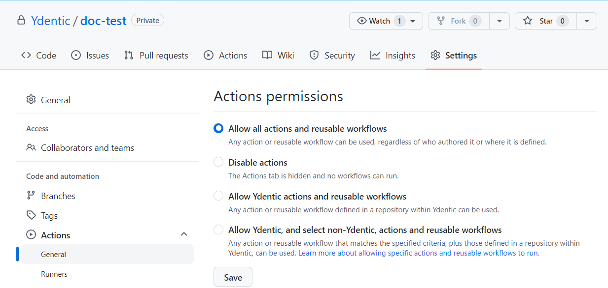
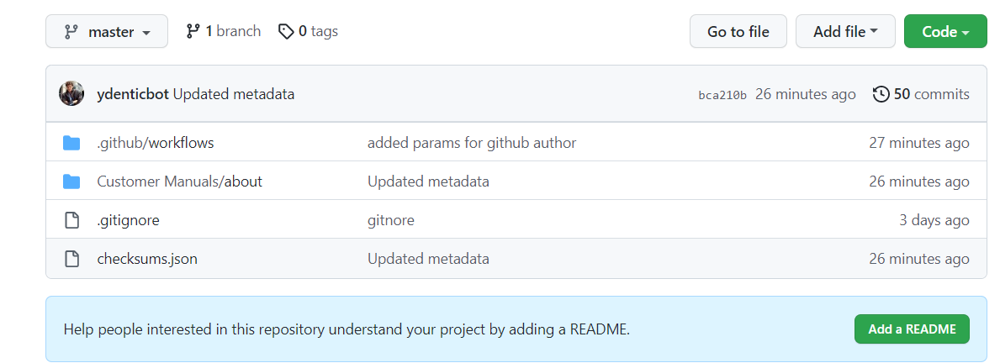

# Ydentic documentation metadata processor

## Introduction
This composite (GitHub) action can be used to add or update metadata for Ydocs source repositories. Metadata like the author, create date and update date are fetched from the Git data. It only updates the metadata of files that were changed.

## Setup

### Workflow
This action can be triggered from any private or public GitHub repository. GitHub external workflows needs to be enabled.

Follow these steps to create the Github action:
-	Go to https://github.com and open the documentation repository.
-	Open to the `Actions` tab.
-	Select `Simple workflow` -> `Configure`
-	Change the name to something like `workflow.yml`.
-	Copy the template below:


``` yaml
name: 'Documentation metadata processing flow'

on: 
  push:
    branches:
      - master
      - releases/**

jobs:
  build:
    runs-on: ubuntu-latest
    permissions:
      contents: write
    steps:
      - name: Run build action
        uses: ydentic/ydocs-metadata-processor@v1.0.2
        with:
          github-author-name: <insert author name>
          github-author-email: <insert author email>
          github-token: ${{ secrets.GITHUB_TOKEN }}
          documentation-directory: <instert documentation folder (optional)>
```

Replace the placeholders of the template:
- **Mandatory:** Replace `<insert author name>` with the name of a service account in GitHub or just something recognizable for instance. "Developer" or "Documentation bot"
- **Mandatory:** Replace `<insert author email>` with the email of a service account in GitHub or just something recognizable for instance. "developer@companyname.com" or "documentation-bot@companyname.com"
- *Optional:* You can change the name as you please. This is not really important for the process but is required for the workflow creation.
- *Optional:* You can edit the `branches` property to anything you'd like for as long as it matches branch names in your documentation repo. The workflow will not start otherwise.
-  *Optional:* You can replace `<instert documentation folder (optional)>` with the name of a folder inside the documentation repository that contains the documentation. For instance `Customer Manuals`. **Remove the entire line from the file if you don't want to customize it.**

> Don't include the `<` and `>` around the placeholders.

### Repository settings

Follow these steps to allow external actions:
-	Go to https://github.com and open the documentation repository.
-	Open to the `Settings` tab.
- Open `Actions` -> `General`.
- Click on the radiobutton of `Allow all actions and resusable workflows`.
- Click on `Save`.



## Reference

### Repository structure example


### Action parameter documentation

Branch definition
https://docs.github.com/en/actions/using-workflows/workflow-syntax-for-github-actions#using-filters
